<p dir="rtl">

<p dir="rtl">
<strong><span style="text-decoration:underline;">آناتومی یک unit test </span></strong> \
 \
در این فصل باقی‌مانده از بخش اول، برخی موضوعات پایه‌ای را برای شما بازبینی خواهم کرد.</p>

<p dir="rtl">
صورت معمولی unit test را که معمولاً با الگوی ترتیب آماده‌سازی، اقدام و ادعا (AAA) نمادین می‌شود را بررسی خواهم کرد. همچنین فریم‌ورک آزمون‌های واحد دلخواه من یعنی xUnit را نیز شرح خواهم داد و دلایلی را که چرا از آن و نه رقبای این فریم‌ورک استفاده می‌کنم، بیان خواهم کرد.</p>

<p dir="rtl">
در این مسیر، در مورد نام‌گذاری آزمون‌های واحد صحبت خواهیم کرد. در این زمینه، مقالات بیشماری وجود دارد و اکثر آن‌ها برای بهبود unit test  های شما کار نسبتا خوبی انجام نمی‌دهند. در این فصل، این روش‌های کمتر کارآمد را بیانی خواهم کرد و خواهم نشان داد که چرا عمدتاً انتخاب مناسبی نیستند. به جای این روش‌ها، راهنمایی ساده و آسان برای نام‌گذاری آزمون‌ها را که آن‌ها را برای برنامه‌نویس ارائه‌دهنده، و علاوه بر آن هر کس دیگری که با موضوع اصلی آشنا باشد خوانابخش می‌کند، ارائه می‌دهم.</p>

<p dir="rtl">
در نهایت، در مورد برخی ویژگی‌های فریم‌ورک که در سرعت‌زایی فرایند unit test کمک می‌کنند، صحبت خواهم کرد. از این امر نگران نباشید که این اطلاعات بیش از حد خاص با C# و .NET هستند؛ اکثر فریم‌ورک‌های unit test توابع شبیه را دارند، بدون اعتبار سنّت برنامه‌نویسی. اگر یکی از آن‌ها را یاد بگیرید، مشکلی در کارکرد با یکی دیگر نخواهید داشت.</p>

<p dir="rtl">
 <strong>ساختار آزمون واحد(how to structure unit test)</strong></p>

<p dir="rtl">
در این بخش، روش ساختاریابی آزمون‌های واحد با استفاده از الگوی arrange ، act و assert (AAA)،  و اینکه از چه دردسرهایی باید اجتناب کرد و چگونه آزمون‌های خود را تا جای ممکن خوانا ساختار دهید، نشان داده می‌شود.</p>

<p dir="rtl">
<strong>استفاده از الگوی AAA</strong></p>

<p dir="rtl">
الگوی AAA تقسیم هر آزمون به سه بخش ارائه کننده‌ی Arrange، Act و Assert است. (این الگو گاهی اوقات نیز الگوی 3A نامیده می‌شود.) در اینجا یک کلاس Calculator با یک روش فرضی را در نظر بگیریم که مجموع دو عدد را محاسبه می‌کند:</p>

```c#
public class Calculator {

public double Sum(double first, double second) {

return first + second;

}

}
```

<p dir="rtl">
لیستینگ ذیل نمونه‌ای از آزمون کلاس را نشان می‌دهد که الگوی AAA را رعایت می‌کند:</p>

<p dir="rtl">


</p>

<p dir="rtl">
الگوی AAA ساختاری ساده و یکنواختی برای تمام آزمون‌های در این مجموعه ارائه می‌دهد. این یکنواختی یکی از بزرگ‌ترین مزایای این الگو است: بعد از آشنایی با آن می‌توانید آزمون‌ها را به سادگی بخوانید و درک کنید. این موضوع به تورمی‌تر شدن هزینه‌های نگهداری برای کل مجموعه آزمون شما کمک می‌کند. ساختار به شرح زیر است:</p>

- در بخش آماده‌سازی(Arrange) ، شما سیستم آزمون (SUT) و وابستگی‌های آن را به حالت دلخواه خود برسانید.
- در بخش اقدام(Act) ، شما روش‌های در سیستم آزمون فراخوانی می‌کنید، وابستگی‌های آماده شده را به آن منتقل می‌کنید و مقدار خروجی (اگر وجود داشته باشد) را ضبط می‌کنید.
- در بخش ادعا (Assert) ، شما نتایج را تأیید می‌کنید. نتیجه ممکن است با ارزش بازگشتی(return value)، وضعیت نهایی SUT و موارد مربوط به آن و یا روش‌هایی که SUT بر روی موارد مرتبط خود فراخوانی کرده‌است، نمایان شود.

      <p dir="rtl">

  <strong>الگوی Given-When-Then</strong></p>

      <p dir="rtl">

  احتمالاً قبلاً نام الگوی Given-When-Then را شنیده‌اید که شبیه الگوی AAA است. این الگو نیز تقسیم آزمون به سه بخش را توصیه می‌کند:</p>

      <p dir="rtl">

   Given - به بخش آماده‌سازی اشاره دارد</p>

      <p dir="rtl">

   When - به بخش اقدام اشاره دارد</p>

      <p dir="rtl">

   Then - به بخش ادعا اشاره دارد</p>

      <p dir="rtl">

  بین این دو الگو در مورد ترکیب آزمون هیچ فرقی وجود ندارد. تنها تفاوت، خوانایی بالاتر الگوی Given-When-Then برای غیرمتخصصان برنامه‌نویسی است. بنابراین، Given-When-Then برای آزمون‌هایی که با افراد غیرتخصصی به اشتراک گذاشته می‌شوند، مناسب‌تر است.</p>

<p dir="rtl">
تمایل طبیعی این است که از بخش آماده‌سازی  (arrange)برای نوشتن یک تست آغاز کنید. به عبارتی، این بخش قبل از دو بخش دیگر می‌آید. این روش در بیشتر موارد کار می‌کند، اما شروع از بخش ادعا  (assertion)نیز یک گزینه معقول است. هنگامی که شما مبتنی بر توسعه مبتنی بر تست (Test-Driven Development (TDD)) هستید، یعنی هنگامی که تستی ایجاد می‌کنید قبل از این که یک ویژگی توسعه دهید، به اندازه کافی در مورد رفتار ویژگی آگاه نیستید. بنابراین، چیزی که از رفتار انتظار می‌رود را ابتدا طرح بکشید و سپس به تشخیص دادن این که چگونه می‌توانید سیستم را برای برآوردن این انتظار توسعه دهید، اهمیت دارد.</p>

<p dir="rtl">
این تکنیک ممکن است خلاف انتطار و غیر معقول به نظر برسد، اما این روشی است که ما در حل مسأله پیش میگیریم. ما با این که به هدف خود فکر می‌کنیم آغاز می‌کنیم: انجام هر رفتار خاصی چه چیزی برای ما انجام می‌دهد. حل مسأله واقعی پس از آن اتفاق می‌افتد. نوشتن  assertقبل از همه چیز تنها یک رسمی‌سازی از این فرآیند فکری است.</p>

<p dir="rtl">
بله، البته این راهنما فقط زمانی مناسب است که شما از TDD استفاده کنید، یعنی زمانی که تست را قبل از کد تولیدی می‌نویسید. اگر کد تولیدی را قبل از تست بنویسید، تا زمانی که به تست می‌رسید، شما از رفتار مورد انتظار آگاه هستید، بنابراین شروع با بخش ترتیب (arrange)بهترین گزینه است.</p>

<p dir="rtl">
<strong>3.1.2جلوگیری از تعدد قسمت های arrange , act and assert </strong></p>

<p dir="rtl">
گاهی اوقات ممکن است با تست‌هایی با بخش‌های مختلف Arrange، Act و Assert روبرو شوید. معمولاً این تست‌ها به شکلی نشان داده می‌شوند که در شکل ۳.۱ نشان داده شده است. وقتی بخش‌های متعددی از Act که توسط بخش‌های Assert و، احتمالاً، Arrange جدا شده‌اند، مشاهده می‌کنید، این به این معناست که تست واحدهای  (unit test)مختلف رفتار را تأیید می‌کند. و همانطور که در فصل ۲ بحث کردیم، چنین تستی دیگر تست واحد نیست و به جای آن تست ادغامی است.</p>

<p dir="rtl">


</p>

<p dir="rtl">
بهتر است از ساختار تستی که در آن یک دستور تکرار می‌شود، پرهیز کنید. یک عمل تکی مطمئن می‌شود که تست‌های شما در حوزه تست واحد باقی می‌مانند، که به این معناست که ساده، سریع و آسان برای درک هستند. اگر تستی را که دارای دنباله‌ای از عمل‌ها و تأییدها(actions and assertions)  است، مشاهده می‌کنید، آن را بازسازی کنید. هر عمل را به عنوان یک تست جداگانه استخراج کنید.</p>

<p dir="rtl">
گاهی اوقات در تست‌های ادغامی، داشتن بخش‌های متعددی از عمل‌ها ممکن است مناسب باشد. همانطور که از فصل قبل به یاد دارید، تست‌های ادغامی ممکن است کند باشند. یک راه برای افزایش سرعت آن‌ها، گروه‌بندی تست‌های ادغامی مختلف در یک تست تکی  (unit test)با چند عمل و تأیید است. این به ویژه زمانی که وضعیت‌های سیستم به طور طبیعی از یکدیگر جاری می‌شوند و به هم وابسته هستند، مفید است: به عبارت دیگر، زمانی که یک عمل به عنوان ترتیب برای عمل بعدی عمل می‌کند. اما دوباره، این تکنیک بهینه‌سازی فقط برای تست‌های ادغامی قابل اجرا است - و نه همه آن‌ها، بلکه آن‌هایی که قبلاً کند بوده‌اند و نمی‌خواهید آن‌ها کند‌تر شوند. در تست‌های واحد یا تست‌های ادغامی که به اندازه کافی سریع هستند، هیچ نیازی به چنین بهینه‌سازی‌ای نیست. همیشه بهتر است یک تست واحد چند مرحله‌ای را به چندین تست تقسیم کنید.</p>

<p dir="rtl">
<strong> \
3.1.3 از نوشتن if در تست ها جلوگیری کنید</strong> </p>

<p dir="rtl">
بله، مشابه تکرارهای متعدد از بخش‌های Arrange، Act و Assert، گاهی اوقات ممکن است با یک تست واحد با یک عبارت if مواجه شوید. این نیز یک الگوی ضد-الگو(anti-pattern)  است. یک تست - برای تست واحد یا تست ادغامی - باید یک دنباله ساده از مراحل بدون شاخه‌بندی باشد. \
یک عبارت if نشان‌دهنده‌ی این است که تست بیش از حد چیزهای مختلف را در یک بار تأیید (assert)می‌کند. به همین دلیل، چنین تستی باید به چندین تست تقسیم شود. اما برخلاف شرایطی که در بخش‌های متعدد AAA وجود دارد، برای تست‌های ادغامی هیچ استثناءی وجود ندارد. در یک تست، شاخه‌بندی هیچ مزیتی ندارد. شما فقط هزینه‌های تعمیراتی اضافی را به دست می‌آورید: عبارات if تست‌ها را سخت‌تر در خواندن و درک کردن می‌کنند.</p>

<p dir="rtl">
3.1.4 <strong>هر بخش چقدر میتواند بزرگ باشد؟ \
</strong>یک سوال رایج که افراد شروع به تست نویسی با الگوی AAA میکنند این است که هر بخش چقدر باید بزرگ باشد؟ و چه بسیاری در مورد بخش تصفیه - بخشی که پس از آزمون پاک می‌کند - سوال ایجاد شده است. معیارهای مختلفی برای اندازه هر یک از بخش‌های آزمون وجود دارد:</p>

<p dir="rtl">
<strong>بخش Arrange  بزرگترین بخش است</strong></p>

<p dir="rtl">
بخش Arrange معمولا بزرگترین بخش سه قسمت تست است. این قسمت میتواند به اندازه ترکیب و جمع دو قسمت دیگر باشد. اما اگر خیلی بزرگتر از قسمت های دیگر باشد ، بهتر است که ترتیبات را هر در یک کلاس تست مخصوص یا در یک کلاس سازنده جداگانه، استخراج کنید. دو الگو محبوب وجود دارد که می‌توانند در امکان استفاده دوباره کد در بخش‌های آماده‌سازی  (arrange)کمک کنند: Object Mother و Test Data Builder.</p>

<p dir="rtl">
<strong>حواستان به بخش اقدام (act) که بیشتر از یک خط است باشد!</strong></p>

<p dir="rtl">
بخش act معمولا باید یه خط کد باشد و اگر این بخش دو یا تعداد خط بیشتری باشد ، میتواند نشانگر یک مشکل در قسمت SUT باشد .  \
بهترین روش برای اشاره به این نکته، ارائه دادن یک مثال است. بنابراین بیایید یک مثال از فصل دوم را بررسی کنیم، که من در لیستینگ زیر تکرار می‌کنم. در این مثال، یک مشتری از یک فروشگاه خرید می‌کند.</p>

** \
**


<p align="center">

</p>

<p dir="rtl">
توجه کنید که بخش اقدام در این تست فقط یک تابع فراخوانی شده است، که این یک نشانه از طراحی خوب از API کلاس است. در ضمن، این را با نسخه در لیستینگ 3.3 مقایسه کنید: این بخش اقدام  (act)شامل دو خط است. و این مشکلی در SUT است: به کلاینت نیازمند است تا در خاتمه فروش، یادداشت دوم را فراخوانی کند و بنابراین محافظت از کاپسوله (encapsulation) کمبود دارد.</p>

<p dir="rtl">
در این مثال، نقطه ضعف طراحی در حین استفاده از دو روش متداول برای پرداخت، قابل مشاهده است: ابتدا از purchase() و بعد send(). مدیریت اطلاعات به مشتری در این مورد به بسیاری از نکات مرتبط با فروش مستقیم است. از این رو، این دو مسئولیت می‌تواند در یک کلاس قرار داشته باشند و مشتری تنها پس از فراخوانی از یک روش متداول، یعنی purchase() باید مورد تأیید قرار گیرد.</p>

<p dir="rtl">
تغییر مورد نظر، در واقعیت باعث اصلاح مشکل کمبود محافظت از کاپسوله در SUT می‌شود و این مسئله را در بخش اقدام  (act)ایجاد می‌کند. \


<strong> \
</strong>در اینجا، می‌توانید بخش اقدام لیستینگ 3.3 را بخوانید:</p>

<p dir="rtl">
در خط اول، مشتری به دنبال تحصیل بیست و پنج واحد شامپو از فروشگاه است.</p>

<p dir="rtl">
در خط دوم، موجودی برداشته می‌شود. این برداشت فقط در صورتی رخ می‌دهد که فراخوانی قبلی به Purchase() موفق باشد.</p>

<p dir="rtl">
مشکل با نسخه جدید این است که برای انجام یک عملیات، دو فراخوانی به روش لازم است. توجه کنید که این مسئله با آزمون خود نیست. آزمون همچنان رفتار یک واحد را تأیید می‌کند: فرآیند خرید. مسئله در سطح API کلاس Customer وجود دارد. این کلاس نباید از مشتری تقاضا به فراخوانی روش اضافی کند.</p>

<p dir="rtl">
از منظر حرفه‌ای، خرید موفق دو نتیجه دارد: تحصیل محصول توسط مشتری و کاهش موجودی در فروشگاه. این دو نتیجه باید به صورت همزمان انجام شوند، یعنی باید روش عمومی وجود داشته باشد که هر دو کار را انجام دهد. در غیر این صورت،یک عدم تعادلی ایجاد میشود اگر کد کلاینت فقط تایع اول را فراخوانی کند و تایع دوم را نکند، در این صورت مشتری محصول را بدست خواهد آورد اما مقدارکالا در فروشگاه کاهش نخواهد یافت.به این عدم تعادل و هماهنگی ایجاد شده invariant violation میگویند .  به عمل حفاظت از کد در برابر مشکلات و عدم تعادل و ثبات این چنینی encapsulation یا حفاظت از اطلاعات یا داده‌ها میگویند. </p>

<p dir="rtl">
هنگامی که یک اختلاف به پایگاه داده شما نفوذ می‌کند، این موضوع به مشکل بزرگی تبدیل می‌شود: در این صورت، با راه‌اندازی مجدد برنامه، پاکسازی وضعیت برنامه شما غیرممکن است. شما باید با داده‌های بهم ریخته و اشتباه در پایگاه داده مقابله کنید و ممکن است مجبور شوید به صورت یکی یکی با مشتریان تماس بگیرید و هر مورد را به صورت جداگانه بررسی کنید. فقط تصورکنید چه اتفاقی برای برنامه شما می‌افتد اگر این برنامه قبض محصول را بدون حقیقتاً رزرو کردن موجودی در فروشگاه برای کاربران تأیید کند. این برنامه ممکن است بیش از اندازه موجودی که در آینده ای نزدیک قابل دریافت است، ادعا کند و بفروشد.</p>

<p dir="rtl">
راه‌حل این است که همواره کپسوله‌سازی کد را حفظ کنید. در مثال قبلی، مشتری باید موجودی خریداری‌شده را به عنوان بخشی از متد Purchase از فروشگاه حذف کند و به کد کلاینت برای انجام این کار تکیه نکند. هنگامی که صحبت از حفظ شرایط پایدار است، باید هرگونه اقدام احتمالی که می‌تواند منجر به نقض شرایط پایدار شود را حذف کنید.</p>

<p dir="rtl">
این راهنمایی برای نگه داشتن بخش act در یک خط، برای اکثر کدهایی که منطق کسب‌وکار دارند صادق است، اما برای کدهای utility یا زیرساخت کمتر صدق می‌کند. بنابراین، من نمی‌گویم "هرگز این کار را نکنید." با این حال، مطمئن شوید که هر مورد را برای یک نقض احتمالی در کپسوله‌سازی بررسی کنید.</p>

## <p dir="rtl">

3.1.5 <strong>بخش assert باید چند تا assertion داشته باشد؟</strong></p>

<p dir="rtl">
در نهایت، بخش assert وجود دارد. ممکن است شنیده باشید که برای هر تست یک assertion داشته باشید. این راهنما بر اساس فرضی است که در فصل قبلی مورد بحث قرار گرفت: فرض هدف‌گیری کوچکترین قسمت کد ممکن.</p>

<p dir="rtl">
همانطور که می‌دانید، این فرض نادرست است. یک واحد در تست واحد(unit test)، یک واحد رفتار است نه یک واحد کد. یک واحد رفتار می‌تواند چندین نتیجه مختلف داشته باشد و بررسی همه آن‌ها در یک تست مشکلی ندارد.</p>

<p dir="rtl">
با این حال، باید مراقب بخش‌های assertion باشید که بیش از حد بزرگ می‌شوند: این می‌تواند نشانه‌ای از یک انتزاع گمشده در کد تولید باشد. به عنوان مثال، به جای بررسی تمام خواص داخل یک شیء که توسط SUT برگردانده شده، ممکن است بهتر باشد اعضای برابری مناسب را در کلاس آن شیء تعریف کنید. سپس می‌توانید شیء را با یک مقدار مورد انتظار با استفاده از یک assertion مقایسه کنید.</p>

## <p dir="rtl">

3.1.6<strong> بخش teardown چیست؟</strong></p>

<p dir="rtl">
برخی افراد بخش چهارمی به نام teardown را نیز متمایز می‌کنند که بعد از arrange، act و assert می‌آید. به عنوان مثال، می‌توانید از این بخش برای حذف هر فایلی که توسط تست ایجاد شده، قطع اتصال به پایگاه داده وغیره استفاده کنید. بخش teardown معمولاً با یک متد جداگانه که در تمام تست‌های کلاس مورد استفاده مجدد قرار می‌گیرد، نمایش داده می‌شود. بنابراین، من این فاز را در الگوی AAA نمی‌گنجانم.</p>

<p dir="rtl">
توجه داشته باشید که بیشتر تست‌های واحد نیاز به teardown ندارند. تست‌های واحد با وابستگی‌های خارج از پردازش صحبت نمی‌کنند و بنابراین اثرات جانبی که نیاز به حذف دارند باقی نمی‌گذارند. این حوزه تست‌های یکپارچه‌سازی است. در بخش سوم بیشتر درباره چگونگی پاک‌سازی درست پس از تست‌های یکپارچه‌سازی صحبت خواهیم کرد.</p>

## <p dir="rtl">

3.1.7 <strong>تمایز سیستم تحت تست</strong></p>

<p dir="rtl">
SUT نقش مهمی در تست‌ها ایفا می‌کند. این نقطه ورودی برای رفتاری است که می‌خواهید در برنامه اجرا کنید. همانطور که در فصل قبلی بحث کردیم، این رفتار می‌تواند شامل چندین کلاس یا تنها یک متد باشد. اما فقط می‌تواند یک نقطه ورودی وجود داشته باشد: یک کلاس که آن رفتار را تحریک می‌کند.</p>

<p dir="rtl">
بنابراین مهم است که SUT را از وابستگی‌هایش متمایز کنید، به خصوص وقتی که تعداد زیادی از آن‌ها وجود دارد، تا زمان زیادی برای تشخیص هر کدام در تست صرف نکنید. برای انجام این کار، همیشه در تست‌ها SUT را sut نام‌گذاری کنید. لیست زیر نشان می‌دهد که CalculatorTests پس از تغییر نام نمونه Calculator چگونه خواهد بود.</p>

<p dir="rtl">


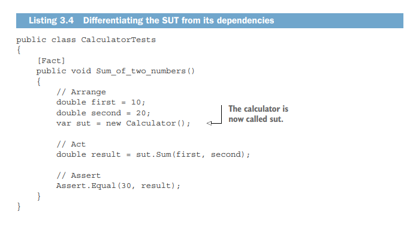
</p>

## <p dir="rtl">

3.1.8 <strong>حذف کردن نظرات arrange، act، و assert از تست‌ها</strong></p>

<p dir="rtl">
همانطور که جدا کردن SUT از وابستگی‌هایش مهم است، تفکیک سه بخش از یکدیگر نیز مهم است تا برای تشخیص اینکه هر خط تست به کدام بخش تعلق دارد، زمان زیادی صرف نکنید. یک راه برای انجام این کار این است که قبل از شروع هر بخش نظرات // Arrange، // Act و // Assert را قرار دهید. راه دیگر این است که بخش‌ها را با خطوط خالی از هم جدا کنید، همانطور که در زیر نشان داده شده است.</p>

<p dir="rtl">


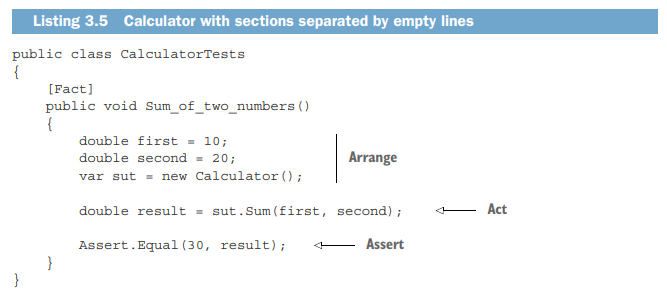
</p>

<p dir="rtl">
جدا کردن بخش‌ها با خطوط خالی در بیشتر تست‌های واحد بسیار خوب عمل می‌کند. این روش به شما اجازه می‌دهد تعادلی بین اختصار و خوانایی حفظ کنید. اما در تست‌های بزرگتر به خوبی کار نمی‌کند، جایی که ممکن است بخواهید خطوط خالی اضافی داخل بخش arrange برای تمایز بین مراحل پیکربندی قرار دهید. این اغلب در تست‌های یکپارچه‌سازی رخ می‌دهد، زیرا آنها معمولاً دارای منطق راه‌اندازی پیچیده هستند. بنابراین:</p>

- نظرات بخش‌ها را در تست‌هایی که از الگوی AAA پیروی می‌کنند و می‌توانید از خطوط خالی اضافی در بخش‌های arrange و assert اجتناب کنید، حذف کنید.
- در غیر این صورت، نظرات بخش‌ها را حفظ کنید.

## <p dir="rtl">

3.2 <strong>بررسی فریم ورک تست xUnit</strong></p>

<p dir="rtl">
در این بخش، یک مرور مختصر از ابزارهای تست واحد موجود در .NET و ویژگی‌های آن‌ها ارائه می‌دهم. من از xUnit به عنوان فریم ورک تست واحد (unit test) استفاده می‌کنم (توجه داشته باشید که برای اجرای تست‌های xUnit در Visual Studio نیاز به نصب بسته NuGet به نام xunit.runner.visualstudio دارید). اگرچه این فریم ورک فقط در .NET کار می‌کند، هر زبان شی‌گرا (Java, C++, JavaScript و غیره) فریم ورک های تست واحد دارد و همه آن‌ها به طور کلی مشابه یکدیگر هستند. اگر با یکی از آن‌ها کار کرده باشید، با دیگری مشکلی نخواهید داشت.</p>

<p dir="rtl">
در خود .NET، چندین جایگزین برای انتخاب وجود دارد، مانند NUnit و Microsoft MSTest داخلی. من شخصاً xUnit را به دلایلی که به زودی توضیح خواهم داد ترجیح می‌دهم، اما شما می‌توانید از NUnit نیز استفاده کنید؛ این دو فریم ورک از نظر کارکرد تقریباً هم‌سطح هستند. من MSTest را توصیه نمی‌کنم؛ MSTest همان سطح از انعطاف‌پذیری xUnit و NUnit را ارائه نمی‌دهد. و به حرف من اکتفا نکنید - حتی افراد درون مایکروسافت نیز از MSTest استفاده نمی‌کنند. به عنوان مثال، تیم ASP.NET Core از xUnit استفاده می‌کند.</p>

<p dir="rtl">
من xUnit را ترجیح می‌دهم زیرا نسخه‌ای تمیزتر و مختصرتر از NUnit است. به عنوان مثال، ممکن است متوجه شده باشید که در تست‌هایی که تاکنون آورده‌ام، هیچ ویژگی مرتبط با فریم ورک وجود ندارد جز [Fact]، که متد را به عنوان یک تست واحد علامت‌گذاری می‌کند تا فریم ورک تست واحد بداند آن را اجرا کند. هیچ ویژگی [TestFixture] وجود ندارد؛ هر کلاس عمومی می‌تواند شامل یک تست واحد باشد. همچنین ویژگی [SetUp] یا [TearDown] وجود ندارد. اگر نیاز به اشتراک‌گذاری منطق پیکربندی بین تست‌ها دارید، می‌توانید آن را داخل سازنده قرار دهید. و اگر نیاز به پاک‌سازی چیزی دارید، می‌توانید رابط IDisposable را پیاده‌سازی کنید، همان‌طور که در این لیست نشان داده شده است.</p>

<p dir="rtl">


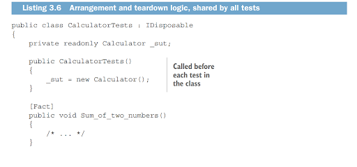


<p dir="rtl">
همانطور که می‌بینید، نویسندگان xUnit گام‌های مهمی برای ساده‌سازی این فریم‌ورک برداشتند. بسیاری از مفاهیمی که قبلاً نیاز به پیکربندی اضافی داشتند (مانند ویژگی‌های [TestFixture] یا [SetUp]) اکنون به کنوانسیون‌ها یا ساختارهای داخلی زبان متکی هستند.</p>

<p dir="rtl">
من به خصوص ویژگی [Fact] را دوست دارم، به ویژه به این دلیل که به جای Test به آن Fact گفته می‌شود. این تأکید می‌کند بر قاعده کلی که در فصل قبلی به آن اشاره کردم: هر تست باید یک داستان بگوید. این داستان یک سناریوی منفرد و اتمی یا حقیقتی درباره دامنه مسئله است و تست موفقیت‌آمیز اثبات می‌کند که این سناریو یا حقیقت درست است. اگر تست شکست بخورد، یا داستان دیگر معتبر نیست و باید بازنویسی شود، یا سیستم باید اصلاح شود.</p>

<p dir="rtl">
من شما را تشویق می‌کنم که این روش تفکر را هنگام نوشتن تست‌های واحد اتخاذ کنید. تست‌های شما نباید فقط یک فهرست بی‌روح از کاری که کد تولید انجام می‌دهد باشند. بلکه باید توصیف سطح بالاتری از رفتار برنامه ارائه دهند. ایده‌آل این است که این توصیف نه تنها برای برنامه‌نویسان، بلکه برای افراد کسب و کار نیز معنادار باشد.</p>

## <p dir="rtl">

3.3<strong> استفاده مجدد از تنظیمات تست بین تست‌ها</strong></p>

<p dir="rtl">
مهم است که بدانید چگونه و چه زمانی کد را بین تست‌ها استفاده ی دوباره کنید. بازاستفاده از کد بین بخش‌های arrange راه خوبی برای کوتاه کردن و ساده کردن تست‌های شما است و این بخش نشان می‌دهد که چگونه این کار را به درستی انجام دهید.</p>

<p dir="rtl">
قبلاً ذکر کردم که اغلب، تنظیمات fixture فضای زیادی را اشغال می‌کنند. منطقی است که این تنظیمات را به متدها یا کلاس‌های جداگانه استخراج کنید و سپس بین تست‌ها بازاستفاده کنید. دو راه برای انجام چنین بازاستفاده‌ای وجود دارد، اما تنها یکی از آن‌ها مفید است؛ دیگری منجر به افزایش هزینه‌های نگهداری می‌شود.</p>

<p dir="rtl">
Test fixture</p>

<p dir="rtl">
اصطلاح test fixture دو معنای رایج دارد:</p>

<p dir="rtl">
Test fixture شیء‌ای است که تست بر روی آن اجرا می‌شود. این شیء می‌تواند یک وابستگی معمولی باشد—یک آرگومان که به SUT ارسال می‌شود. همچنین می‌تواند داده‌ای در پایگاه داده یا فایلی روی دیسک سخت باشد. چنین شیئی باید قبل از هر اجرای تست در یک حالت ثابت و شناخته‌شده باقی بماند تا نتیجه یکسانی تولید کند. به همین دلیل از کلمه fixture استفاده می‌شود.</p>

<p dir="rtl">
تعریف دیگر از فریمورک تست NUnit می‌آید. در NUnit، TestFixture یک ویژگی است که یک کلاس حاوی تست‌ها را علامت‌گذاری می‌کند.</p>

<p dir="rtl">
من در طول این کتاب از تعریف اول استفاده می‌کنم.</p>

<p dir="rtl">
اولین راه—نادرست—برای بازاستفاده از test fixtures این است که آن‌ها را در سازنده تست (یا متدی که با ویژگی [SetUp] علامت‌گذاری شده است اگر از NUnit استفاده می‌کنید) مقداردهی اولیه کنید، همان‌طور که در زیر نشان داده شده است.</p>

<p align="center">
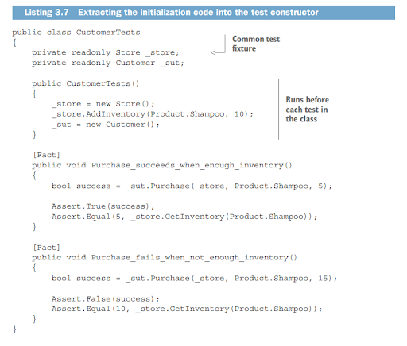
</p>

<p dir="rtl">
دو تست در لیست 3.7 دارای منطق تنظیمات مشترک هستند. در واقع، بخش‌های arrange آن‌ها یکسان هستند و بنابراین می‌توانند کاملاً در سازنده CustomerTests استخراج شوند — که دقیقاً همین کار را اینجا انجام دادم. تست‌ها خودشان دیگر شامل تنظیمات نیستند.</p>

<p dir="rtl">
با این رویکرد، می‌توانید مقدار زیادی از کد تست را کاهش دهید — می‌توانید از بیشتر یا حتی تمام تنظیمات تست‌ها خلاص شوید. اما این تکنیک دو اشکال بزرگ دارد:</p>

- این روش باعث افزایش وابستگی زیاد بین تست‌ها می‌شود.
- این روش باعث کاهش خوانایی تست‌ها می‌شود.

<p dir="rtl">
بیایید این اشکالات را با جزئیات بیشتر بررسی کنیم.</p>

## <p dir="rtl">

3.3.1 <strong>وابستگی زیاد بین تست‌ها یک الگوی نامناسب است.</strong></p>

<p dir="rtl">
در نسخه جدید که در لیست 3.7 نشان داده شده، تمام تست‌ها به یکدیگر وابسته هستند: تغییر در منطق arrangement یک تست، تمام تست‌های کلاس را تحت تأثیر قرار می‌دهد. به عنوان مثال، تغییر این خط</p>

```c#
_store.AddInventory(Product.Shampoo, 10);
```

<p dir="rtl">
به این</p>

```c#
_store.AddInventory(Product.Shampoo, 15);
```

<p dir="rtl">
فرضیات تست‌ها را درباره وضعیت اولیه فروشگاه نامعتبر می‌کند و بنابراین منجر به شکست‌های غیرضروری تست‌ها می‌شود.</p>

<p dir="rtl">
این نقض یک راهنمای مهم است: تغییر در یک تست نباید تست‌های دیگر را تحت تأثیر قرار دهد. این راهنما شبیه به چیزی است که در فصل 2 بحث کردیم - تست‌ها باید به صورت مجزا از یکدیگر اجرا شوند. اما اینجا درباره تغییرات مستقل تست‌ها صحبت می‌کنیم، نه اجرای مستقل. هر دو ویژگی‌های مهمی از یک تست خوب طراحی‌شده هستند.</p>

<p dir="rtl">
برای پیروی از این راهنما، باید از معرفی حالت مشترک در کلاس‌های تست خودداری کنید. این دو فیلد خصوصی مثال‌هایی از چنین حالت مشترکی هستند:</p>

```c#
private readonly Store \_store;

private readonly Customer \_sut;
```

## <p dir="rtl">

3.3.2 <strong>استفاده از سازنده‌ها در تست‌ها خوانایی تست را کاهش می‌دهد.</strong></p>

<p dir="rtl">
عیب دیگر استخراج کد arrangement به سازنده(constructer)، کاهش خوانایی تست است. شما دیگر نمی‌توانید با نگاه کردن به خود تست، تصویر کاملی را ببینید. شما باید مکان‌های مختلف در کلاس را بررسی کنید تا بفهمید متد تست چه کاری انجام می‌دهد. حتی اگر منطق ترتیبات(arrangement) زیاد نباشد—مثلاً فقط نمونه‌سازی از fixtures—باز هم بهتر است آن را مستقیماً به متد تست منتقل کنید. در غیر این صورت، این سوال برایتان پیش می‌آید که آیا واقعاً فقط نمونه‌سازی است یا چیز دیگری هم در آنجا تنظیم شده است. یک تست مستقل شما را با چنین عدم قطعیتی روبرو نمی‌کند.</p>

## <p dir="rtl">

3.3.3 <strong>راهی بهتر برای استفاده مجدد از تنظیمات تست(test fixtures)</strong></p>

<p dir="rtl">
استفاده از سازنده بهترین روش برای استفاده مجدد از تست فیکسچرها نیست. روش دوم - که مفیدتر است - معرفی متدهای کارخانه در کلاس تست است، همانطور که در لیست زیر نشان داده شده است.</p>

<p align="center">
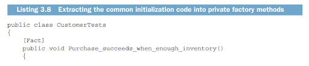
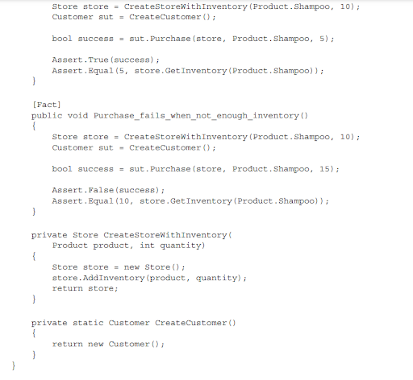
</p>

با استخراج کد اولیه مشترک به متدهای خصوصی کارخانه‌ای، می‌توانید کد تست را کوتاه‌تر کنید، اما در عین حال، تمام زمینه‌های اتفاقاتی که در تست‌ها رخ می‌دهد را حفظ کنید. علاوه بر این، تا زمانی که این متدهای خصوصی را به اندازه کافی عمومی کنید، تست‌ها به یکدیگر متصل نمی‌شوند. به عبارت دیگر، اجازه دهید تست‌ها مشخص کنند که چگونه می‌خواهند اشیاء مورد نیازشان ایجاد شوند.</p>

<p dir="rtl">
به این خط نگاه کنید، برای مثال:</p>

<p dir="rtl">

```c# 
Store store = CreateStoreWithInventory(Product.Shampoo, 10);
```
</p>

<p dir="rtl">
تست به وضوح بیان می‌کند که می‌خواهد متد کارخانه ۱۰ واحد شامپو به فروشگاه اضافه کند. این هم خوانا است و هم قابل استفاده مجدد. خوانا است زیرا نیازی به بررسی داخلی‌های متد کارخانه برای درک ویژگی‌های فروشگاه ایجاد شده نیست. قابل استفاده مجدد است زیرا می‌توانید از این متد در تست‌های دیگر نیز استفاده کنید.</p>

<p dir="rtl">
توجه داشته باشید که در این مثال خاص، نیازی به معرفی متدهای کارخانه‌ای نیست، زیرا منطق اولیه نسبتاً ساده است.فقط به عنوان یک نمایش نگاه کنید.</p>

<p dir="rtl">
یک استثنا برای این قانون بازاستفاده از وسایل تست وجود دارد. شما می‌توانید یک وسیله را در سازنده (constructor) نمونه‌سازی کنید اگر توسط تمام یا تقریباً تمام تست‌ها استفاده شود. این معمولاً برای تست‌های یکپارچه‌سازی که با پایگاه داده کار می‌کنند، صادق است. همه این تست‌ها نیاز به اتصال به پایگاه داده دارند که می‌توانید یک بار آن را مقداردهی اولیه کنید و سپس در همه جا بازاستفاده کنید. اما حتی در آن صورت، بهتر است یک کلاس پایه معرفی کنید و اتصال به پایگاه داده را در سازنده آن کلاس مقداردهی اولیه کنید، نه در کلاس‌های تست جداگانه. لیست زیر نمونه‌ای از کد مقداردهی اولیه مشترک در یک کلاس پایه را نشان می‌دهد.</p>

<p dir="rtl">


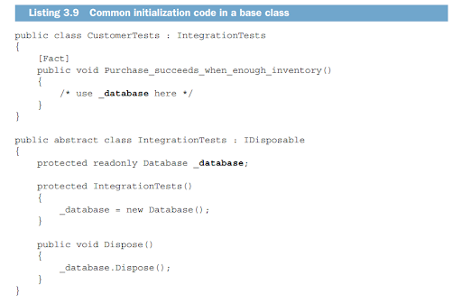

توجه کنید که CustomerTests بدون سازنده باقی می‌ماند. این کلاس از طریق ارث‌بری از کلاس پایه IntegrationTests به نمونه _database دسترسی پیدا می‌کند.</p>

## <p dir="rtl">

3.4<strong> نامگذاری یک تست واحد (unit test)</strong></p>

<p dir="rtl">
اهمیت دارد که به تست‌های خود نام‌های معنادار بدهید. نام‌گذاری صحیح به شما کمک می‌کند تا بفهمید که تست چه چیزی را تأیید می‌کند و سیستم زیرین چگونه رفتار می‌کند.</p>

<p dir="rtl">
پس چگونه باید یک تست واحد را نام‌گذاری کرد؟ در طول دهه گذشته، بسیاری از قراردادهای نام‌گذاری را دیده و امتحان کرده‌ام. یکی از برجسته‌ترین و احتمالاً کم‌فایده‌ترین آن‌ها، قرارداد زیر است:</p>


```c#
[MethodUnderTest]_[Scenario]_[ExpectedResult]
```


<p dir="rtl">
که در آن:</p>

<p dir="rtl">
- MethodUnderTest نام متدی است که در حال تست آن هستید.</p>

<p dir="rtl">
- Scenario شرایطی است که تحت آن متد را تست می‌کنید.</p>

<p dir="rtl">
- ExpectedResult نتیجه‌ای است که انتظار دارید متد تحت تست در شرایط فعلی انجام دهد.</p>

<p dir="rtl">
این قرارداد به‌طور خاص کم‌فایده است زیرا شما را تشویق می‌کند تا بر جزئیات پیاده‌سازی به جای رفتار تمرکز کنید.</p>

<p dir="rtl">
عبارات ساده به زبان انگلیسی بسیار بهتر عمل می‌کنند: آن‌ها بیان‌کننده‌تر هستند و شما را در یک ساختار نام‌گذاری سختگیرانه محدود نمی‌کنند. با عبارات ساده، می‌توانید رفتار سیستم را به‌گونه‌ای توصیف کنید که برای یک مشتری یا کارشناس حوزه معنادار باشد. برای مثال، اینجا یک تست با عنوان به زبان ساده آمده است:</p>

```c#
public class CalculatorTests

{

    [Fact]

    public void Sum_of_two_numbers()

    {

        double first = 10;

        double second = 20;

        var sut = new Calculator();

        double result = sut.Sum(first, second);

        Assert.Equal(30, result);

    }

}
```

<p dir="rtl">
چگونه می‌توان نام این تست (Sum_of_two_numbers) را با استفاده از قرارداد [MethodUnderTest]_[Scenario]_[ExpectedResult] بازنویسی کرد؟ احتمالاً چیزی شبیه به این:</p>

public void Sum_TwoNumbers_ReturnsSum()

<p dir="rtl">
متد تحت تست Sum است، سناریو شامل دو عدد است، و نتیجه مورد انتظار جمع آن دو عدد است. نام جدید از نظر یک برنامه‌نویس منطقی به نظر می‌رسد، اما آیا واقعاً به خوانایی تست کمک می‌کند؟ اصلاً. برای یک فرد غیرمطلع این نام یونانی است. به آن فکر کنید: چرا Sum دو بار در نام تست ظاهر می‌شود؟ و این عبارت Returns چه معنایی دارد؟ جمع به کجا بازگردانده می‌شود؟ شما نمی‌توانید بدانید.</p>

<p dir="rtl">
برخی ممکن است استدلال کنند که واقعاً مهم نیست یک غیر برنامه‌نویس چه فکری درباره این نام دارد. به هر حال، تست‌های واحد توسط برنامه‌نویسان برای برنامه‌نویسان نوشته می‌شوند، نه کارشناسان حوزه. و برنامه‌نویسان در رمزگشایی نام‌های رمزآلود خوب هستند - این کار آن‌هاست!</p>

<p dir="rtl">
این درست است، اما فقط تا حدی. نام‌های رمزگونه بر همه افراد، چه برنامه‌نویس باشند و چه نباشند، بار ذهنی تحمیل می‌کنند. آن‌ها نیاز به ظرفیت ذهنی اضافی برای فهمیدن دقیق آنچه تست بررسی می‌کند و چگونه به نیازهای کسب‌وکار مربوط می‌شود، دارند. این ممکن است چندان مهم به نظر نرسد، اما بار ذهنی به مرور زمان اضافه می‌شود. این به تدریج و به طور یقین هزینه نگهداری کل مجموعه تست‌ها را افزایش می‌دهد.</p>

<p dir="rtl">
این موضوع به ویژه زمانی قابل توجه است که بعد از فراموش کردن جزئیات ویژگی به تست بازگردید یا سعی کنید تست نوشته شده توسط یک همکار را بفهمید. خواندن کد دیگران به خودی خود به اندازه کافی دشوار است - هر کمکی در فهم آن مفید است.</p>

<p dir="rtl">
در اینجا دو نسخه مجدداً آمده‌اند:</p>

```c#
public void Sum_of_two_numbers();
public void Sum_TwoNumbers_ReturnsSum()
```

<p dir="rtl">
نام اولیه که به زبان ساده انگلیسی نوشته شده بسیار ساده‌تر برای خواندن است. این یک توصیف ساده و دقیق از رفتار مورد تست است.</p>

## <p dir="rtl">

3.4.1 <strong>راهنمای نامگذاری تست واحد (unit test)</strong></p>

<p dir="rtl">
رعایت دستورالعمل‌های زیر برای نوشتن نام‌های تست بیانگر و قابل خواندن آسان:</p>

<p dir="rtl">
- از پیروی از یک سیاست نام‌گذاری سخت‌گیرانه خودداری کنید. شما نمی‌توانید یک توضیح سطح بالا از یک رفتار پیچیده را در قالب باریک چنین سیاستی جای دهید. اجازه دهید آزادی بیان وجود داشته باشد.</p>

<p dir="rtl">
- نام تست را به گونه‌ای بگذارید که گویی در حال توصیف سناریو به یک غیر برنامه‌نویس هستید که با حوزه مشکل آشناست. یک کارشناس حوزه یا تحلیلگر کسب‌وکار نمونه خوبی است.</p>

<p dir="rtl">
- کلمات را با زیرخط از هم جدا کنید. این کار به بهبود خوانایی کمک می‌کند، به ویژه در نام‌های طولانی.</p>

<p dir="rtl">
توجه کنید که من از زیرخط‌ها در نام‌گذاری کلاس تست، CalculatorTests، استفاده نکردم. به طور معمول، نام کلاس‌ها به این اندازه طولانی نیست، بنابراین بدون زیرخط‌ها نیز خوب خوانده می‌شوند.</p>

<p dir="rtl">
همچنین توجه کنید که اگرچه من از الگوی [ClassName]Tests در نام‌گذاری کلاس‌های تست استفاده می‌کنم، این به این معنی نیست که تست‌ها محدود به بررسی فقط آن کلاس هستند. به خاطر داشته باشید که واحد در تست واحد یک واحد رفتار است، نه یک کلاس. این واحد می‌تواند یک یا چند کلاس را در بر بگیرد؛ اندازه واقعی آن بی‌اهمیت است. با این حال، شما باید از جایی شروع کنید. به کلاس در [ClassName]Tests به عنوان فقط آن نگاه کنید: یک نقطه ورود، یک API، که با استفاده از آن می‌توانید یک واحد رفتار را بررسی کنید.</p>

## <p dir="rtl">

3.4.2 <strong>مثال: تغییر نام یک تست بر اساس راهنمایی‌ها</strong></p>

<p dir="rtl">
بیایید یک تست را به عنوان مثال در نظر بگیریم و سعی کنیم نام آن را با استفاده از راهنمایی‌هایی که تازه توضیح دادم به تدریج بهبود دهیم. در لیست زیر، شما می‌توانید یک تست را ببینید که تأیید می‌کند یک تحویل با تاریخ گذشته نامعتبر است. نام تست با استفاده از سیاست نام‌گذاری سفت و سخت نوشته شده که به خوانایی تست کمک نمی‌کند.</p>

<p dir="rtl">


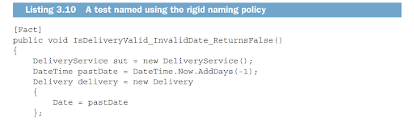
</p>


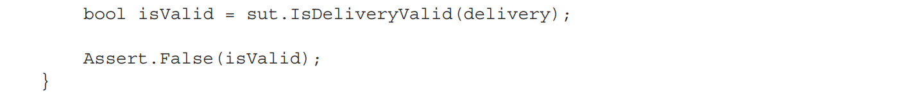
این تست بررسی می‌کند که آیا DeliveryService به درستی یک تحویل با تاریخ نادرست را به عنوان نامعتبر شناسایی می‌کند. چگونه نام این تست را به زبان ساده‌تر بازنویسی می‌کنید؟ تلاش اول خوب می‌تواند به صورت زیر باشد:</p>

public void Delivery_with_invalid_date_should_be_considered_invalid()

<p dir="rtl">
به دو نکته در نسخه جدید توجه کنید:</p>

<p dir="rtl">
- نام اکنون برای یک غیر برنامه‌نویس نیز قابل درک است، که به این معنی است که برنامه‌نویسان نیز راحت‌تر آن را درک خواهند کرد.</p>

<p dir="rtl">
- نام متد SUT—IsDeliveryValid—دیگر بخشی از نام تست نیست.</p>

<p dir="rtl">
نکته دوم نتیجه طبیعی بازنویسی نام تست به زبان ساده‌تر است و بنابراین به راحتی قابل چشم‌پوشی است. با این حال، این نتیجه مهم است و می‌تواند به عنوان یک راهنما در نظر گرفته شود.</p>

<p dir="rtl">
نام متد تحت تست در نام تست</p>

<p dir="rtl">
نام متد SUT را در نام تست قرار ندهید. به یاد داشته باشید که شما کد را تست نمی‌کنید، بلکه رفتار برنامه را تست می‌کنید. بنابراین، نام متد تحت تست مهم نیست. همانطور که قبلاً ذکر شد، SUT فقط یک نقطه ورودی است: یک وسیله برای فراخوانی یک رفتار. شما می‌توانید تصمیم بگیرید که نام متد تحت تست را به چیزی مثل IsDeliveryCorrect تغییر دهید و این تأثیری بر رفتار SUT نخواهد داشت. از طرف دیگر، اگر از روش نام‌گذاری اصلی پیروی کنید، باید نام تست را تغییر دهید. این بار دیگر نشان می‌دهد که هدف قرار دادن کد به جای رفتار، تست‌ها را به جزئیات پیاده‌سازی آن کد متصل می‌کند که این موضوع تأثیر منفی بر نگهداری مجموعه تست دارد. توضیحات بیشتر در این باره در فصل ۵ ارائه خواهد شد.</p>

<p dir="rtl">
تنها استثناء این راهنما زمانی است که روی کدهای utility کار می‌کنید. این کدها منطق کسب‌وکار را شامل نمی‌شوند - رفتار آن‌ها از عملکردهای کمکی ساده فراتر نمی‌رود و بنابراین برای افراد کسب‌وکار معنایی ندارد. در این موارد، استفاده از نام متد SUT مشکلی ندارد.</p>

<p dir="rtl">
اما بیایید به مثال برگردیم. نام جدید تست شروع خوبی است، اما می‌تواند بیشتر بهبود یابد. دقیقاً معنی "تاریخ تحویل نامعتبر" چیست؟ از تست در فهرست 3.10 می‌توانیم ببینیم که تاریخ نامعتبر هر تاریخی در گذشته است. این منطقی است — شما باید فقط مجاز به انتخاب تاریخ تحویل در آینده باشید.</p>

<p dir="rtl">
پس بیایید خاص‌تر باشیم و این دانش را در نام تست منعکس کنیم:</p>

public void Delivery_with_past_date_should_be_considered_invalid()

<p dir="rtl">
این بهتر است اما هنوز ایده‌آل نیست. خیلی طولانی است. می‌توانیم بدون از دست دادن معنی کلمه considered را حذف کنیم:</p>

public void Delivery_with_past_date_should_be_invalid()

<p dir="rtl">
واژه should be نیز یک الگوی ضد رایج است. در اوایل این فصل ذکر شد که یک تست یک واقعیت واحد و اتمی درباره یک واحد رفتار است. جایی برای یک آرزو یا تمایل هنگام بیان یک واقعیت وجود ندارد. نام تست را مطابق واقعیت بگذارید — should be را با is جایگزین کنید:</p>

public void Delivery_with_past_date_is_invalid()

<p dir="rtl">
و در نهایت، نیازی به اجتناب از دستور زبان ساده انگلیسی نیست. حروف تعریف به خواندن روان‌تر تست کمک می‌کنند. حرف تعریف a را به نام تست اضافه کنید:</p>

public void Delivery_with_a_past_date_is_invalid()

<p dir="rtl">
این نسخه نهایی یک بیان مستقیم از یک واقعیت است که یکی از جنبه‌های رفتار برنامه تحت تست را توصیف می‌کند: در این مورد خاص، جنبه تعیین اینکه آیا تحویل می‌تواند انجام شود یا خیر.</p>

## <p dir="rtl">

3.5 <strong>بازسازی تست‌های پارامتری شده</strong></p>

<p dir="rtl">
یک تست معمولاً برای توصیف کامل یک واحد رفتار کافی نیست. چنین واحدی معمولاً از چندین جزء تشکیل شده است که هر کدام باید با تست خودشان بررسی شوند. اگر رفتار به اندازه کافی پیچیده باشد، تعداد تست‌هایی که آن را توصیف می‌کنند می‌تواند به طور چشمگیری افزایش یابد و ممکن است غیر قابل مدیریت شود. خوشبختانه، بیشتر چارچوب‌های تست واحد امکاناتی را فراهم می‌کنند که به شما اجازه می‌دهد تست‌های مشابه را با استفاده از تست‌های پارامتری گروه‌بندی کنید.</p>

<p dir="rtl">


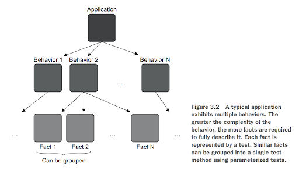
</p>

<p dir="rtl">
در این بخش، ابتدا هر جزء رفتاری را که توسط یک تست جداگانه توصیف شده است نشان می‌دهم و سپس نحوه گروه‌بندی این تست‌ها را به شما نشان می‌دهم.</p>

<p dir="rtl">
فرض کنید که قابلیت تحویل ما به گونه‌ای عمل می‌کند که نزدیک‌ترین تاریخ تحویل مجاز دو روز از حالا است. واضح است که تنها یک تست کافی نیست. علاوه بر تستی که تاریخ تحویل گذشته را بررسی می‌کند، به تست‌هایی نیاز داریم که تاریخ امروز، تاریخ فردا و تاریخ پس فردا را بررسی کنند.</p>

<p dir="rtl">
تست موجود با نام Delivery_with_a_past_date_is_invalid نامیده می‌شود. می‌توانیم سه تست دیگر اضافه کنیم:</p>

```c#
public void Delivery_for_today_is_invalid();

public void Delivery_for_tomorrow_is_invalid();

public void The_soonest_delivery_date_is_two_days_from_now();
```

<p dir="rtl">
اما این منجر به چهار متد تست می‌شود که تنها تفاوت بین آن‌ها تاریخ تحویل است.</p>

<p dir="rtl">
یک رویکرد بهتر گروه‌بندی این تست‌ها در یک تست است تا مقدار کد تست کاهش یابد. xUnit (مانند اکثر چارچوب‌های تست دیگر) ویژگی‌ای به نام تست‌های پارامتری دارد که به شما اجازه می‌دهد دقیقا این کار را انجام دهید. لیست بعدی نشان می‌دهد که چنین گروه‌بندی چگونه به نظر می‌رسد. هر ویژگی InlineData یک حقیقت جداگانه در مورد سیستم را نشان می‌دهد؛ این خود یک مورد تست است.</p>

<p dir="rtl">


</p>

<p dir="rtl">
هر واقعیت اکنون توسط یک خط [InlineData] نشان داده می‌شود، نه یک تست جداگانه. من همچنین نام متد تست را به چیزی عمومی‌تر تغییر دادم: دیگر اشاره‌ای به اینکه چه چیزی یک تاریخ معتبر یا نامعتبر را تشکیل می‌دهد، ندارد.</p>

<p dir="rtl">
با استفاده از تست‌های پارامتری، می‌توانید به طور قابل توجهی مقدار کد تست را کاهش دهید، اما این مزیت با هزینه‌ای همراه است. اکنون سخت است که بفهمید متد تست چه واقعیت‌هایی را نشان می‌دهد. و هر چه تعداد پارامترها بیشتر باشد، این کار سخت‌تر می‌شود. به عنوان یک سازش، می‌توانید مورد تست مثبت را به یک تست جداگانه استخراج کنید و از نامگذاری توصیفی در جایی که بیشترین اهمیت را دارد بهره‌مند شوید - در تعیین اینکه چه چیزی تاریخ‌های تحویل معتبر و نامعتبر را متمایز می‌کند، همانطور که در لیست زیر نشان داده شده است.</p>

<p dir="rtl">


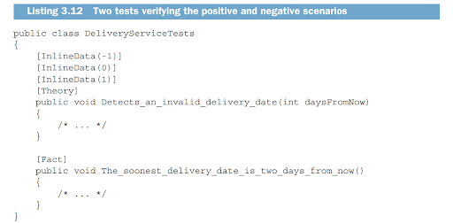
</p>

<p dir="rtl">
این رویکرد همچنین تست‌های منفی را ساده‌تر می‌کند، زیرا می‌توانید پارامتر بولین مورد انتظار را از متد تست حذف کنید. و البته، می‌توانید متد تست مثبت را نیز به یک تست پارامتری تبدیل کنید تا تاریخ‌های مختلف را تست کنید. همانطور که می‌بینید، بین مقدار کد تست و خوانایی آن کد یک مبادله وجود دارد. به عنوان یک قاعده کلی، تست‌های مثبت و منفی را فقط زمانی در یک متد نگه دارید که از ورودی‌ها به وضوح مشخص است که کدام مورد برای چه چیزی است. در غیر این صورت، تست‌های مثبت را استخراج کنید. و اگر رفتار خیلی پیچیده است، اصلاً از تست‌های پارامتری استفاده نکنید. هر مورد تست منفی و مثبت را با متد تست خودش نمایش دهید.</p>

## <p dir="rtl">

3.5.1 <strong>جمع آوری دیتا از تست های پارامتری شده</strong></p>

<p dir="rtl">
در استفاده از تست‌های پارامتری (حداقل در .NET) نکاتی وجود دارد که باید از آن‌ها آگاه باشید. توجه کنید که در فهرست 3.11، من از پارامتر daysFromNow به عنوان ورودی متد تست استفاده کردم. ممکن است بپرسید چرا نه تاریخ و زمان واقعی؟ متأسفانه، کد زیر کار نمی‌کند:</p>

```c#
[InlineData(DateTime.Now.AddDays(-1), false)]

[InlineData(DateTime.Now, false)]

[InlineData(DateTime.Now.AddDays(1), false)]

[InlineData(DateTime.Now.AddDays(2), true)]

[Theory]

public void Can_detect_an_invalid_delivery_date(

    DateTime deliveryDate,

    bool expected)

{

    DeliveryService sut = new DeliveryService();

    Delivery delivery = new Delivery

    {

        Date = deliveryDate

    };

    bool isValid = sut.IsDeliveryValid(delivery);

    Assert.Equal(expected, isValid);

}
```

<p dir="rtl">
در C#، محتوای تمام attribute ها در زمان کامپایل ارزیابی می‌شود. شما باید فقط از مقادیری استفاده کنید که کامپایلر می‌تواند آن‌ها را درک کند که شامل موارد زیر هستند:</p>

<p dir="rtl">
- ثابت‌ها</p>

<p dir="rtl">
- مقادیر </p>

<p dir="rtl">
- عبارت‌های typeof()</p>

<p dir="rtl">
فراخوانی DateTime.Now به زمان اجرای .NET متکی است و بنابراین مجاز نیست.</p>

<p dir="rtl">
یک راه برای غلبه بر این مشکل وجود دارد. xUnit ویژگی دیگری دارد که می‌توانید از آن برای تولید داده‌های سفارشی برای تغذیه به متد تست استفاده کنید: [MemberData]. فهرست بعدی نشان می‌دهد که چگونه می‌توانیم تست قبلی را با استفاده از این ویژگی بازنویسی کنیم.</p>

<p dir="rtl">


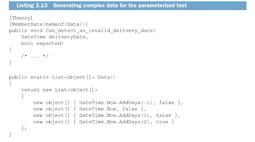
</p>

<p dir="rtl">
MemberData نام یک متد استاتیک که مجموعه‌ای از داده‌های ورودی تولید می‌کند را می‌پذیرد (کامپایلر nameof(Data) را به یک literal "Data" ترجمه می‌کند). هر عنصر از این مجموعه خود یک مجموعه است که به دو پارامتر ورودی: deliveryDate و expected نگاشت می‌شود. با این ویژگی، می‌توانید محدودیت‌های کامپایلر را دور بزنید و از پارامترهایی با هر نوع در تست‌های پارامتری استفاده کنید.</p>

<p dir="rtl">
3.6 استفاده از یک کتابخانه اعتبارسنجی برای بهبود بیشتر خوانایی تست</p>

<p dir="rtl">
یکی دیگر از کارهایی که می‌توانید برای بهبود خوانایی تست‌ها انجام دهید، استفاده از کتابخانه assertions است. من شخصاً Fluent Assertions را ترجیح می‌دهم، اما .NET چندین کتابخانه رقابتی در این زمینه دارد. </p>

<p dir="rtl">
مزیت اصلی استفاده از کتابخانه assertions این است که می‌توانید ساختار assertions را به گونه‌ای تغییر دهید که خواناتر باشد. اینجا یکی از تست‌های قبلی ماست:</p>

```c#
[Fact]

public void Sum_of_two_numbers()

{

var sut = new Calculator();

double result = sut.Sum(10, 20);

Assert.Equal(30, result);

}
```

<p dir="rtl">
اکنون آن را با نسخه زیر که از fluent assertion استفاده می‌کند مقایسه کنید:
</p>

```c#
[Fact]

public void Sum_of_two_numbers()

{

var sut = new Calculator();

double result = sut.Sum(10, 20);

result.Should().Be(30);

}
```

<p dir="rtl">
assertion در تست دوم به زبان ساده انگلیسی خوانده می‌شود، که دقیقاً همانطور است که شما می‌خواهید تمام کدهای شما خوانده شود. ما به عنوان انسان‌ها ترجیح می‌دهیم اطلاعات را به صورت داستان جذب کنیم. همه داستان‌ها از این الگو پیروی می‌کنند:</p>

<p dir="rtl">
[فاعل] [فعل] [مفعول].</p>

<p dir="rtl">
برای مثال، </p>

<p dir="rtl">
باب در را باز کرد.</p>

<p dir="rtl">
اینجا، باب فاعل است، باز کرد فعل است، و در مفعول است. همین قانون برای کد هم اعمال می‌شود. result.Should().Be(30) بهتر از Assert.Equal(30, result) خوانده می‌شود، زیرا دقیقاً به دلیل پیروی از الگوی داستان است. این یک داستان ساده است که در آن result فاعل است، should be فعل است و 30 مفعول است.</p>

<p dir="rtl">
کتابخانه Fluent Assertions همچنین تعداد زیادی متدهای کمکی برای assert کردن اعداد، رشته‌ها، مجموعه‌ها، تاریخ و زمان، و بسیاری موارد دیگر فراهم می‌کند. تنها نقطه ضعف این است که چنین کتابخانه‌ای یک وابستگی اضافی است که ممکن است نخواهید به پروژه خود اضافه کنید (اگرچه فقط برای توسعه است و به تولید ارسال نمی‌شود).</p>

## <p dir="rtl">

<strong>خلاصه:</strong></p>

- تمام تست‌های واحد باید الگوی AAA را دنبال کنند: arrange، act، assert. اگر یک تست دارای چندین بخش arrange، act، یا assert باشد، این نشانه‌ای است که تست چند واحد رفتار را به‌طور همزمان بررسی می‌کند. اگر این تست قرار است تست واحد باشد، آن را به چندین تست تقسیم کنید - هر کدام برای یک عمل.
- بیش از یک خط در بخش act نشانه‌ای از مشکل در API سیستم تحت تست است. این نیاز به کلاینت دارد که همیشه به یاد داشته باشد این اقدامات را با هم انجام دهد، که می‌تواند منجر به ناسازگاری‌ها شود. چنین ناسازگاری‌هایی نقض شرایط پایدار نامیده می‌شوند. عمل محافظت از کد در برابر نقض شرایط پایدار احتمالی کپسوله‌سازی نامیده می‌شود.
- سیستم تحت تست را در تست‌ها با نام‌گذاری آن به عنوان sut متمایز کنید. سه بخش تست را یا با قرار دادن نظرات Arrange، Act، و Assert قبل از آنها یا با معرفی خطوط خالی بین این بخش‌ها متمایز کنید.
- کد اولیه سازی سازنده تست‌ها را با معرفی متدهای کارخانه‌ای مجدداً استفاده کنید، نه با قرار دادن این کد اولیه سازی در سازنده. چنین استفاده مجددی به حفظ درجه بالای جداسازی بین تست‌ها کمک می‌کند و همچنین خوانایی بهتری فراهم می‌کند.
- از سیاست نام‌گذاری سختگیرانه تست استفاده نکنید. هر تست را طوری نام‌گذاری کنید که انگار دارید سناریوی آن را به یک غیر برنامه‌نویس که با دامنه مشکل آشناست توضیح می‌دهید. کلمات را در نام تست با زیرخط جدا کنید و نام متد تحت تست را در نام تست قرار ندهید.
- تست‌های پارامتری به کاهش مقدار کد مورد نیاز برای تست‌های مشابه کمک می‌کنند. نقطه ضعف این است که نام تست‌ها با افزایش عمومی‌تر شدن کمتر خوانا می‌شوند.
- کتابخانه‌های assertions به شما کمک می‌کنند تا خوانایی تست را با بازسازی ترتیب کلمات در assertions به گونه‌ای که مانند زبان ساده انگلیسی خوانده شوند، بهبود دهید.

</p>
