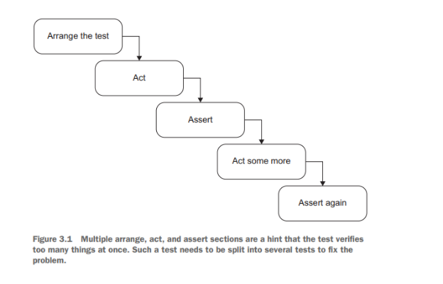
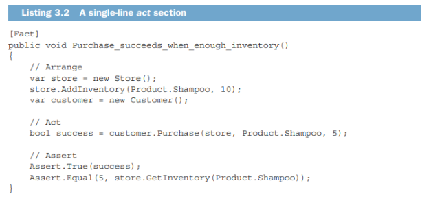
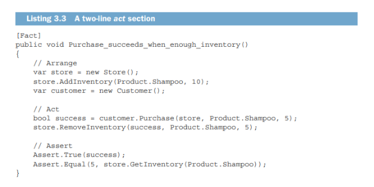

<div dir="rtl">

# آناتومی یک unit test

در این فصل باقی‌مانده از بخش اول، برخی موضوعات پایه‌ای را برای شما بازبینی خواهم کرد.

صورت معمولی unit test را که معمولاً با الگوی ترتیب آماده‌سازی، اقدام و ادعا (AAA) نمادین می‌شود را بررسی خواهم کرد. همچنین فریم‌ورک آزمون‌های واحد دلخواه من یعنی xUnit را نیز شرح خواهم داد و دلایلی را که چرا از آن و نه رقبای این فریم‌ورک استفاده می‌کنم، بیان خواهم کرد.

در این مسیر، در مورد نام‌گذاری آزمون‌های واحد صحبت خواهیم کرد. در این زمینه، مقالات بیشماری وجود دارد و اکثر آن‌ها برای بهبود unit test های شما کار نسبتا خوبی انجام نمی‌دهند. در این فصل، این روش‌های کمتر کارآمد را بیانی خواهم کرد و خواهم نشان داد که چرا عمدتاً انتخاب مناسبی نیستند. به جای این روش‌ها، راهنمایی ساده و آسان برای نام‌گذاری آزمون‌ها را که آن‌ها را برای برنامه‌نویس ارائه‌دهنده، و علاوه بر آن هر کس دیگری که با موضوع اصلی آشنا باشد خوانابخش می‌کند، ارائه می‌دهم.

در نهایت، در مورد برخی ویژگی‌های فریم‌ورک که در سرعت‌زایی فرایند unit test کمک می‌کنند، صحبت خواهم کرد. از این امر نگران نباشید که این اطلاعات بیش از حد خاص با C# و .NET هستند؛ اکثر فریم‌ورک‌های unit test توابع شبیه را دارند، بدون اعتبار سنّت برنامه‌نویسی. اگر یکی از آن‌ها را یاد بگیرید، مشکلی در کارکرد با یکی دیگر نخواهید داشت.

` `**ساختار آزمون واحد(how to structure unit test)**

در این بخش، روش ساختاریابی آزمون‌های واحد با استفاده از الگوی arrange ، act و assert (AAA)، و اینکه از چه دردسرهایی باید اجتناب کرد و چگونه آزمون‌های خود را تا جای ممکن خوانا ساختار دهید، نشان داده می‌شود.

**استفاده از الگوی AAA**

الگوی AAA تقسیم هر آزمون به سه بخش ارائه کننده‌ی Arrange، Act و Assert است. (این الگو گاهی اوقات نیز الگوی 3A نامیده می‌شود.) در اینجا یک کلاس Calculator با یک روش فرضی را در نظر بگیریم که مجموع دو عدد را محاسبه می‌کند:

```c#
public class Calculator {

public double Sum(double first, double second) {

return first + second;

}

}
```

لیستینگ ذیل نمونه‌ای از آزمون کلاس را نشان می‌دهد که الگوی AAA را رعایت می‌کند:

<p align='center'>

</p>

الگوی AAA ساختاری ساده و یکنواختی برای تمام آزمون‌های در این مجموعه ارائه می‌دهد. این یکنواختی یکی از بزرگ‌ترین مزایای این الگو است: بعد از آشنایی با آن می‌توانید آزمون‌ها را به سادگی بخوانید و درک کنید. این موضوع به تورمی‌تر شدن هزینه‌های نگهداری برای کل مجموعه آزمون شما کمک می‌کند. ساختار به شرح زیر است:

- در بخش آماده‌سازی(Arrange) ، شما سیستم آزمون (SUT) و وابستگی‌های آن را به حالت دلخواه خود برسانید.
- در بخش اقدام(Act) ، شما روش‌های در سیستم آزمون فراخوانی می‌کنید، وابستگی‌های آماده شده را به آن منتقل می‌کنید و مقدار خروجی (اگر وجود داشته باشد) را ضبط می‌کنید.
- در بخش ادعا (Assert) ، شما نتایج را تأیید می‌کنید. نتیجه ممکن است با ارزش بازگشتی(return value)، وضعیت نهایی SUT و موارد مربوط به آن و یا روش‌هایی که SUT بر روی موارد مرتبط خود فراخوانی کرده‌است، نمایان شود.

**الگوی Given-When-Then**

احتمالاً قبلاً نام الگوی Given-When-Then را شنیده‌اید که شبیه الگوی AAA است. این الگو نیز تقسیم آزمون به سه بخش را توصیه می‌کند:

¡ Given - به بخش آماده‌سازی اشاره دارد

¡ When - به بخش اقدام اشاره دارد

¡ Then - به بخش ادعا اشاره دارد

بین این دو الگو در مورد ترکیب آزمون هیچ فرقی وجود ندارد. تنها تفاوت، خوانایی بالاتر الگوی Given-When-Then برای غیرمتخصصان برنامه‌نویسی است. بنابراین، Given-When-Then برای آزمون‌هایی که با افراد غیرتخصصی به اشتراک گذاشته می‌شوند، مناسب‌تر است.

تمایل طبیعی این است که از بخش آماده‌سازی (arrange)برای نوشتن یک تست آغاز کنید. به عبارتی، این بخش قبل از دو بخش دیگر می‌آید. این روش در بیشتر موارد کار می‌کند، اما شروع از بخش ادعا (assertion)نیز یک گزینه معقول است. هنگامی که شما مبتنی بر توسعه مبتنی بر تست (Test-Driven Development (TDD)) هستید، یعنی هنگامی که تستی ایجاد می‌کنید قبل از این که یک ویژگی توسعه دهید، به اندازه کافی در مورد رفتار ویژگی آگاه نیستید. بنابراین، چیزی که از رفتار انتظار می‌رود را ابتدا طرح بکشید و سپس به تشخیص دادن این که چگونه می‌توانید سیستم را برای برآوردن این انتظار توسعه دهید، اهمیت دارد.

این تکنیک ممکن است خلاف انتطار و غیر معقول به نظر برسد، اما این روشی است که ما در حل مسأله پیش میگیریم. ما با این که به هدف خود فکر می‌کنیم آغاز می‌کنیم: انجام هر رفتار خاصی چه چیزی برای ما انجام می‌دهد. حل مسأله واقعی پس از آن اتفاق می‌افتد. نوشتن assertقبل از همه چیز تنها یک رسمی‌سازی از این فرآیند فکری است.

بله، البته این راهنما فقط زمانی مناسب است که شما از TDD استفاده کنید، یعنی زمانی که تست را قبل از کد تولیدی می‌نویسید. اگر کد تولیدی را قبل از تست بنویسید، تا زمانی که به تست می‌رسید، شما از رفتار مورد انتظار آگاه هستید، بنابراین شروع با بخش ترتیب (arrange)بهترین گزینه است.

**3.1.2جلوگیری از تعدد قسمت های arrange , act and assert**

گاهی اوقات ممکن است با تست‌هایی با بخش‌های مختلف Arrange، Act و Assert روبرو شوید. معمولاً این تست‌ها به شکلی نشان داده می‌شوند که در شکل ۳.۱ نشان داده شده است. وقتی بخش‌های متعددی از Act که توسط بخش‌های Assert و، احتمالاً، Arrange جدا شده‌اند، مشاهده می‌کنید، این به این معناست که تست واحدهای (unit test)مختلف رفتار را تأیید می‌کند. و همانطور که در فصل ۲ بحث کردیم، چنین تستی دیگر تست واحد نیست و به جای آن تست ادغامی است.

<p align="center">

</p>

بهتر است از ساختار تستی که در آن یک دستور تکرار می‌شود، پرهیز کنید. یک عمل تکی مطمئن می‌شود که تست‌های شما در حوزه تست واحد باقی می‌مانند، که به این معناست که ساده، سریع و آسان برای درک هستند. اگر تستی را که دارای دنباله‌ای از عمل‌ها و تأییدها(actions and assertions) است، مشاهده می‌کنید، آن را بازسازی کنید. هر عمل را به عنوان یک تست جداگانه استخراج کنید.

گاهی اوقات در تست‌های ادغامی، داشتن بخش‌های متعددی از عمل‌ها ممکن است مناسب باشد. همانطور که از فصل قبل به یاد دارید، تست‌های ادغامی ممکن است کند باشند. یک راه برای افزایش سرعت آن‌ها، گروه‌بندی تست‌های ادغامی مختلف در یک تست تکی (unit test)با چند عمل و تأیید است. این به ویژه زمانی که وضعیت‌های سیستم به طور طبیعی از یکدیگر جاری می‌شوند و به هم وابسته هستند، مفید است: به عبارت دیگر، زمانی که یک عمل به عنوان ترتیب برای عمل بعدی عمل می‌کند. اما دوباره، این تکنیک بهینه‌سازی فقط برای تست‌های ادغامی قابل اجرا است - و نه همه آن‌ها، بلکه آن‌هایی که قبلاً کند بوده‌اند و نمی‌خواهید آن‌ها کند‌تر شوند. در تست‌های واحد یا تست‌های ادغامی که به اندازه کافی سریع هستند، هیچ نیازی به چنین بهینه‌سازی‌ای نیست. همیشه بهتر است یک تست واحد چند مرحله‌ای را به چندین تست تقسیم کنید.

**3.1.3 از نوشتن if در تست ها جلوگیری کنید**

بله، مشابه تکرارهای متعدد از بخش‌های Arrange، Act و Assert، گاهی اوقات ممکن است با یک تست واحد با یک عبارت if مواجه شوید. این نیز یک الگوی ضد-الگو(anti-pattern) است. یک تست - برای تست واحد یا تست ادغامی - باید یک دنباله ساده از مراحل بدون شاخه‌بندی باشد.
یک عبارت if نشان‌دهنده‌ی این است که تست بیش از حد چیزهای مختلف را در یک بار تأیید (assert)می‌کند. به همین دلیل، چنین تستی باید به چندین تست تقسیم شود. اما برخلاف شرایطی که در بخش‌های متعدد AAA وجود دارد، برای تست‌های ادغامی هیچ استثناءی وجود ندارد. در یک تست، شاخه‌بندی هیچ مزیتی ندارد. شما فقط هزینه‌های تعمیراتی اضافی را به دست می‌آورید: عبارات if تست‌ها را سخت‌تر در خواندن و درک کردن می‌کنند.

3\.1.4 **هر بخش چقدر میتواند بزرگ باشد؟**
یک سوال رایج که افراد شروع به تست نویسی با الگوی AAA میکنند این است که هر بخش چقدر باید بزرگ باشد؟ و چه بسیاری در مورد بخش تصفیه - بخشی که پس از آزمون پاک می‌کند - سوال ایجاد شده است. معیارهای مختلفی برای اندازه هر یک از بخش‌های آزمون وجود دارد:

**بخش Arrange بزرگترین بخش است**

بخش Arrange معمولا بزرگترین بخش سه قسمت تست است. این قسمت میتواند به اندازه ترکیب و جمع دو قسمت دیگر باشد. اما اگر خیلی بزرگتر از قسمت های دیگر باشد ، بهتر است که ترتیبات را هر در یک کلاس تست مخصوص یا در یک کلاس سازنده جداگانه، استخراج کنید. دو الگو محبوب وجود دارد که می‌توانند در امکان استفاده دوباره کد در بخش‌های آماده‌سازی (arrange)کمک کنند: Object Mother و Test Data Builder.

**حواستان به بخش اقدام (act) که بیشتر از یک خط است باشد!**

بخش act معمولا باید یه خط کد باشد و اگر این بخش دو یا تعداد خط بیشتری باشد ، میتواند نشانگر یک مشکل در قسمت SUT باشد .
بهترین روش برای اشاره به این نکته، ارائه دادن یک مثال است. بنابراین بیایید یک مثال از فصل دوم را بررسی کنیم، که من در لیستینگ زیر تکرار می‌کنم. در این مثال، یک مشتری از یک فروشگاه خرید می‌کند.

<p align="center">

</p>
توجه کنید که بخش اقدام در این تست فقط یک تابع فراخوانی شده است، که این یک نشانه از طراحی خوب از API کلاس است. در ضمن، این را با نسخه در لیستینگ 3.3 مقایسه کنید: این بخش اقدام (act)شامل دو خط است. و این مشکلی در SUT است: به کلاینت نیازمند است تا در خاتمه فروش، یادداشت دوم را فراخوانی کند و بنابراین محافظت از کاپسوله (encapsulation) کمبود دارد.

در این مثال، نقطه ضعف طراحی در حین استفاده از دو روش متداول برای پرداخت، قابل مشاهده است: ابتدا از purchase() و بعد send(). مدیریت اطلاعات به مشتری در این مورد به بسیاری از نکات مرتبط با فروش مستقیم است. از این رو، این دو مسئولیت می‌تواند در یک کلاس قرار داشته باشند و مشتری تنها پس از فراخوانی از یک روش متداول، یعنی purchase() باید مورد تأیید قرار گیرد.

تغییر مورد نظر، در واقعیت باعث اصلاح مشکل کمبود محافظت از کاپسوله در SUT می‌شود و این مسئله را در بخش اقدام (act)ایجاد می‌کند.
<p align="center">

</p>

</div >
